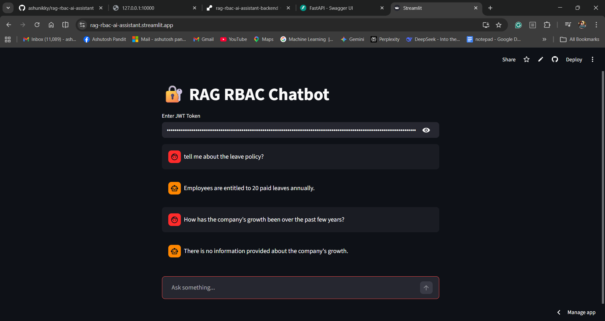
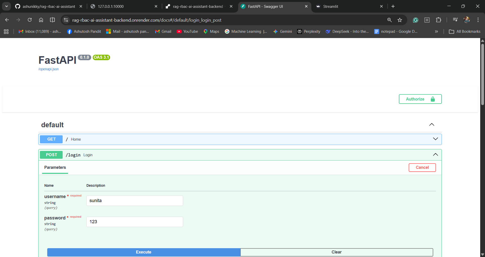

# 🔐 RAG-Based RBAC Assistant

A **secure, production-style Retrieval-Augmented Generation (RAG) chatbot** with **Role-Based Access Control (RBAC)**.

This system ensures that users can only access information relevant to their role while receiving intelligent, context-aware responses powered by an LLM.

---

## Preview





## 🚀 Features

* 🔐 **JWT Authentication**
* 🧠 **RAG Pipeline (Retriever + LLM)**
* 🏢 **Role-Based Access Control (RBAC)**
* 📄 **Source Attribution**
* ⚡ **Streaming Responses (ChatGPT-like)**
* 💬 **Chat Memory (context-aware conversations)**
* 🌐 **FastAPI Backend**
* 🎨 **Streamlit Chat UI**

---

## 🏗️ Architecture

```
User (Streamlit UI)
        ↓
FastAPI (Auth + RBAC)
        ↓
Retriever (Chroma Vector DB)
        ↓
LLM (Groq - LLaMA 3)
        ↓
Response + Sources
```

---

## 🧑‍💼 Roles & Permissions

| Role        | Access                      |
| ----------- | --------------------------- |
| Finance     | Financial reports, expenses |
| Marketing   | Campaigns, customer data    |
| HR          | Employee data, payroll      |
| Engineering | Technical docs              |
| C-Level     | Full access                 |
| Employee    | General info                |

---

## 🛠️ Tech Stack

* **Backend**: FastAPI
* **Frontend**: Streamlit
* **Vector DB**: Chroma
* **LLM**: Groq (LLaMA 3)
* **Embeddings**: OpenAI
* **Auth**: JWT
* **Environment**: Conda + `uv`

---

## 📁 Project Structure

```
rag-rbac/
│
├── app/
│   ├── api/
│   ├── auth/
│   ├── db/
│   ├── rag/
│   ├── llm/
│   └── main.py
│
├── data/
├── ui/
└── README.md
```

---

## ⚙️ Setup Instructions

### 1️⃣ Clone Repo

```bash
git clone https://github.com/ashunikky/rag-rbac-ai-assistant.git
cd rag-rbac
```

---

### 2️⃣ Create Environment

```bash
conda create -n rag-rbac python=3.11
conda activate rag-rbac
```

---

### 3️⃣ Install Dependencies

```bash
pip install uv
uv sync
```

---

### 4️⃣ Add Environment Variables

Create `.env`:

```
GROQ_API_KEY=your_groq_key
OPENAI_API_KEY=your_openai_key
SECRET_KEY=your_secret
```

---

### 5️⃣ Run Backend

```bash
uvicorn app.main:app --reload
```

---

### 6️⃣ Run UI

```bash
streamlit run ui/app.py
```

---

## 🔐 Authentication Flow

1. Login → Get JWT Token
2. Use token in UI
3. Role extracted from token
4. RBAC enforced in retrieval

---

## 🔑 Authentication & Authorization

- Users authenticate via `/login` endpoint
- A **JWT token** is generated upon successful login
- The token contains:
  - `username`
  - `role`
- Every request to `/chat` requires this token

### 🔒 Role-Based Access Control (RBAC)

- Each document contains `access_roles` metadata
- During retrieval:
  - Only documents matching the user’s role are returned
- This ensures **secure, role-restricted responses**

✅ Example:
- HR user → can access employee data
- Finance user → cannot access HR data

## 🔐 Demo Credentials

This project currently uses **hardcoded users for demonstration purposes**.

| Username       | Password | Role        |
|----------------|----------|-------------|
| ravi           | 1234     | Finance     |
| sunita         | 1234     | HR          |
| priya          | 1234     | Marketing   |
| rohit          | 1234     | Engineering |
| ashutosh       | 1234     | C-Level     |
| raj            | 1234     | Employee    |

👉 Use these credentials to log in and obtain a JWT token.


## 📸 Screenshots

*Add screenshots here (UI + Swagger)*

---

## 🧠 Key Learnings

* Secure RAG system design
* RBAC implementation in vector search
* Handling LLM hallucination
* Streaming responses
* Full-stack AI application development

---

## 🚀 Future Improvements

* Multi-user DB authentication
* Deployment (AWS/GCP)
* RAG evaluation (Ragas)
* Chat history persistence

---

## 👨‍💻 Author

Ashutosh Pandit (https://www.linkedin.com/in/ashutosh-pandit-64a375102/)

---

## ⭐ If you like this project, give it a star!
